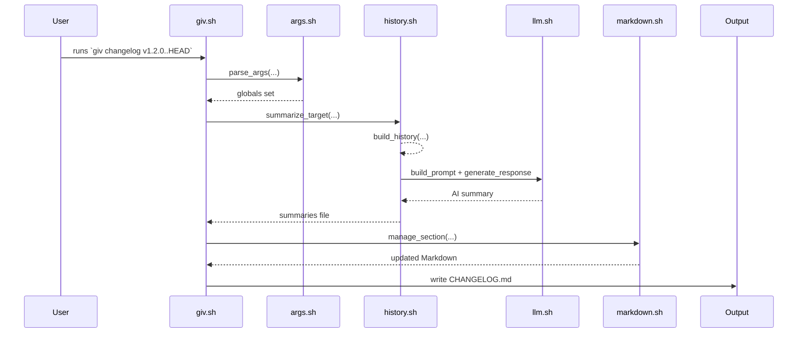
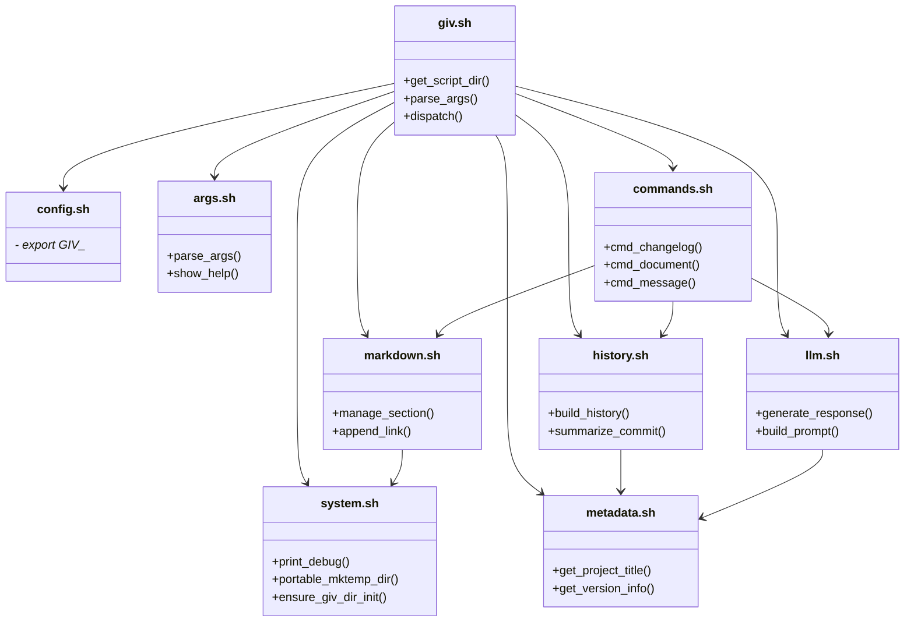
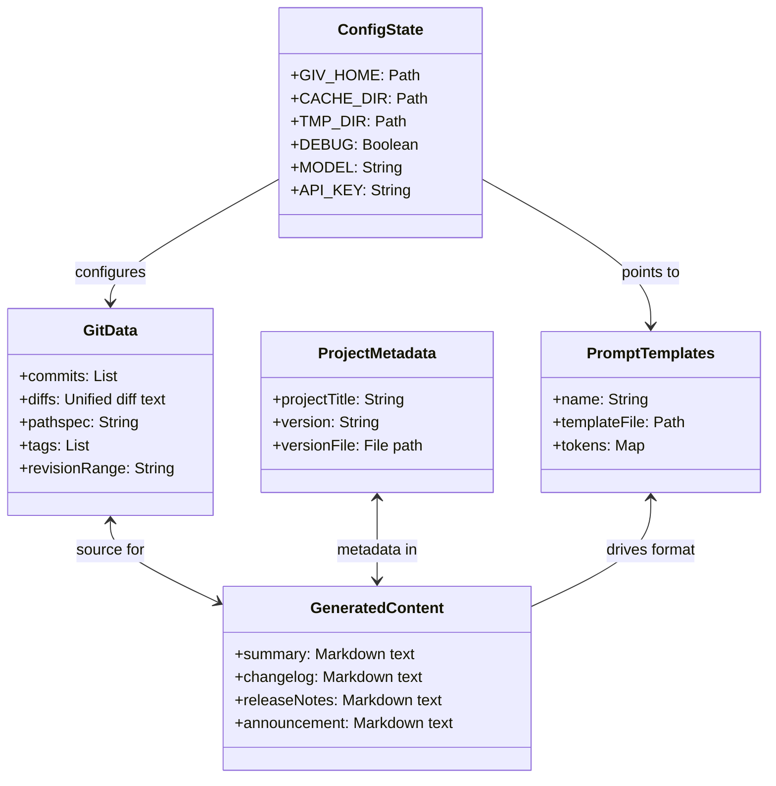
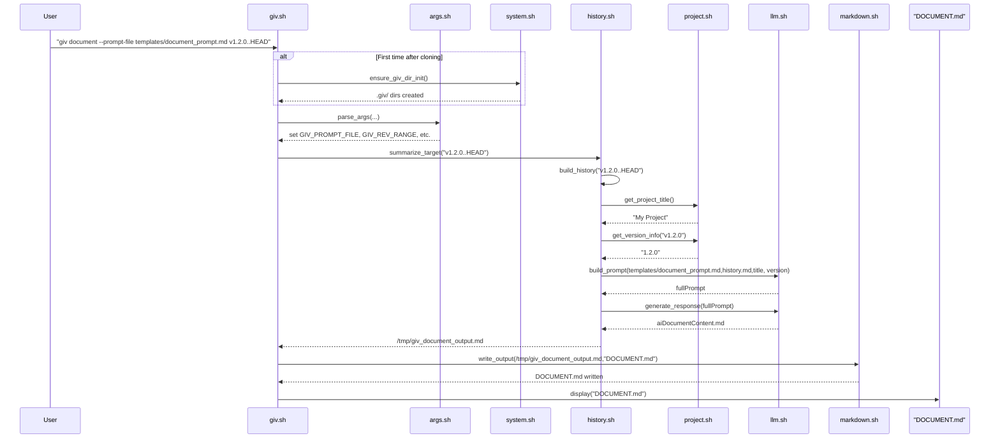

# Architecture

A quick overview: giv is a POSIX-compliant shell script suite whose main entrypoint (giv.sh) initializes environment and dispatches subcommands. It sources modular libraries for configuration, system utilities, argument parsing, Markdown handling, LLM integration, project metadata, history extraction, and subcommand implementations. Major workflows include commit summarization (via summarize\_commit), changelog generation (cmd\_changelog), release-notes and announcements (via cmd\_document), and a generic document driver. Data domains span Git metadata (commits, diffs, tags), project metadata (version files, project titles), AI prompt templates, and generated summaries. Caching under `.giv/cache` avoids redundant work. Below are the details.

## Repository Structure

### Script Entry Point

The main script, **giv.sh**, locates the library, template, and docs directories, sources all helper modules, parses arguments, and dispatches to subcommands like `message`, `summary`, `changelog`, `release-notes`, `announcement`, `document`, and maintenance commands (`init`, `update`) ([giv.sh][1]).

### Configuration Module

**config.sh** exports globals for version (`__VERSION`), directory paths (`GIV_HOME`, `GIV_TMP_DIR`, `GIV_CACHE_DIR`), debugging flags, default Git revision/pathspec, AI model and API settings, project tokens, and default output filenames (`CHANGELOG.md`, etc.) ([config.sh][2]).

### System Utilities

**system.sh** provides logging functions (`print_debug`, `print_info`, etc.), temporary-dir management (`portable_mktemp_dir`, `remove_tmp_dir`), `.giv` directory initialization (`ensure_giv_dir_init`), and location helpers (`find_giv_dir`) ([system.sh][3]).

### Argument Parsing

**args.sh** defines `show_help` and `parse_args`, mapping CLI options to `GIV_*` variables, validating revisions/pathspecs, handling config files early, and configuring local vs remote AI modes ([args.sh][4]).

### Markdown Handling

**markdown.sh** implements `manage_section` for append/prepend/update of Markdown sections, `append_link` to add links, utilities for stripping and normalizing Markdown (`strip_markdown`, `normalize_blank_lines`), and Markdown viewing via `glow` ([markdown.sh][5]).

### LLM Integration

**llm.sh** handles JSON-escaping (`json_escape`), remote API calls (`generate_remote` via curl), local inference (`run_local` via Ollama), response parsing (`extract_content_from_response`), and high-level `generate_response`, along with prompt token replacement (`replace_tokens`), prompt building (`build_prompt`), and execution (`generate_from_prompt`) ([llm.sh][6]).

### Project Metadata

**metadata.sh** extracts project titles and version information from common project files like `package.json`, `pyproject.toml`, and `setup.py`. It also supports custom version file detection ([metadata.sh][7]).

### History Extraction

**history.sh** provides utilities for summarizing Git history, extracting TODO changes, and caching summaries ([history.sh][8]).

### Subcommand Implementations

**commands.sh** ties everything into user-facing commands: `cmd_message` for AI draft commit messages, `cmd_changelog` for changelog updates (using `manage_section`), `cmd_document` as a generic driver for release-notes, announcements, custom docs, and maintenance commands (`show_version`, `get_available_releases`, `run_update`) ([commands.sh][9]).

## Data Domains

1. **Git Data**: Commits, diffs, staged/unstaged changes, untracked files, commit dates, tags and ranges (handled by `build_diff`, `get_commit_date`, Git plumbing) ([history.sh][8]).
2. **Project Metadata**: Version files (`package.json`, etc.), extracted versions (`get_version_info`), and project titles (`get_project_title`) ([metadata.sh][7]).
3. **AI Prompt Templates**: Markdown templates stored under `templates/` (e.g. `summary_prompt.md`, `changelog_prompt.md`, `release_notes_prompt.md`, `announcement_prompt.md`) ([giv.sh][1]).
4. **Generated Content**: Summary Markdown, commit messages, changelogs, release notes, announcements, managed under `.giv/cache` and output files in project root ([system.sh][3]) ([history.sh][8]).
5. **Configuration & State**: Stored in `.giv/config`, `.giv/cache`, `.giv/.tmp`, and optionally `.giv/templates` (after `init`) ([system.sh][3]).

## Workflows

### Commit Summarization

The `summarize_commit` function in **history.sh** orchestrates:

1. Generating raw history with `build_history`.
2. Finding version info via `get_version_info`.
3. Building an AI prompt (`build_prompt` with `summary_prompt.md`).
4. Generating the summary (`generate_response`).
   Caching ensures repeated calls skip regeneration ([history.sh][8], [llm.sh][6]).

### Changelog Generation

`cmd_changelog` in **commands.sh** follows:

1. Summarize commits/ranges with `summarize_target`.
2. Build the changelog prompt (`changelog_prompt.md`) via `build_prompt`.
3. Generate content (`generate_from_prompt`).
4. Update `CHANGELOG.md` using `manage_section` and append a “Managed by giv” link ([commands.sh][9]).

### Release-Notes & Announcements

Both use the generic `cmd_document` driver:

1. Summarize history into temp file.
2. Build prompt from `release_notes_prompt.md` or `announcement_prompt.md`.
3. Call `generate_from_prompt` with tailored temperature and context window ([giv.sh][1]).
4. Output to `RELEASE_NOTES.md` or `ANNOUNCEMENT.md`.

### Generic Document Generation

The `document` subcommand invokes `cmd_document` with a user-supplied `--prompt-file`, enabling arbitrary AI-driven reports over any revision/pathspec ([commands.sh][9]).

## Architecture Diagrams

### Sequence Diagram

### Class Diagram

This should give you a clear view of how the scripts interconnect, the data each component handles, and the flow of execution through the tool.

[1]: /src/giv.sh "giv.sh"
[2]: /src/config.sh "config.sh"
[3]: /src/system.sh "system.sh"
[4]: /src/args.sh "args.sh"
[5]: /src/markdown.sh "markdown.sh"
[6]: /src/llm.sh
[7]: /src/metadata.sh
[8]: /src/history.sh 
[9]: /src/commands.sh 

Across the giv-CLI tool, there are five primary **data domains**—each holding specific values—and the `document` subcommand orchestrates several modules in a well-defined call sequence. Below is a data-structure diagram showing the domains and their key contents, then a detailed sequence diagram illustrating exactly how `giv document` runs under the hood.

---

## Data Domains and Their Contents

* **GitData**: all raw Git artifacts (commits, diffs, tags, revision ranges, pathspecs) used to build histories and summaries.
* **ProjectMetadata**: extracted from files like `package.json` or `pyproject.toml`—contains project title and version info.
* **PromptTemplates**: stored under `templates/`, each named (e.g. `summary_prompt.md`, `changelog_prompt.md`, `document_prompt.md`) with substitution tokens.
* **GeneratedContent**: the AI-produced Markdown blobs (commit messages, changelogs, release notes, documents, announcements).
* **ConfigState**: CLI configuration and state in `.giv/` (home, cache, temp dirs), debug flags, AI model choice, API credentials.

---

## Sequence of `giv document --prompt-file <file> <range>`

1. **Initialization** (once): creates `.giv/` directories.
2. **Argument Parsing**: `args.sh` sets up global vars (prompt file, revision range).
3. **History Extraction**: `history.sh` builds a unified history for the given range, invoking `metadata.sh` for title/version.
4. **Prompt Assembly**: `llm.sh` merges the template, history, and metadata into a single prompt.
5. **AI Generation**: same module calls out to remote/local LLM, returns the document text.
6. **Output**: `markdown.sh` writes the result to `DOCUMENT.md` and the CLI presents it.

These diagrams and explanations should give you a clear map of **what data lives where** and **how the `document` flow unfolds** end-to-end.
